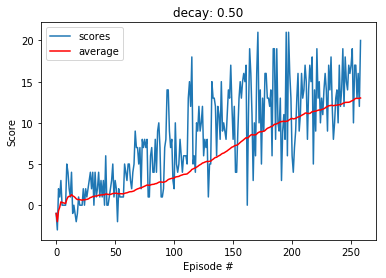

## Learning Algorithm

The implementation follows closely the Deep Q Learning algorithm (DQN) introduced in [this](https://storage.googleapis.com/deepmind-media/dqn/DQNNaturePaper.pdf) research paper.

DQN uses a deep neural network as a nonlinear function approximator to estimate the action-value function (Q-function). 
In order to prevent the instability of this approach, two major enhancements are made:

- Experience replay
The actions an agent took given a certain state together with the received reward and the next state are stored in a so-called experience buffer.
Experiences are state, action, reward, next state combinations.
Uniform distributed samples are drawn from the buffer and then used to update the Q-values.

- Additional network  to generate the targets
The parameters of the trained network are only cloned every to the target network after a delay of C updates. 

## Model Architecture

Both local and target network have the same configuration:
One fully connected input layer, it uses 37 units for the state spaces 64 output unit for the next layer.
The input layer is followed by a fully connected hidden layer with 64 in and output units. 
The output layer is also a fully connected layer that uses 4 output units for the 4 actions.

## Hyperparameters used in the DQN

| Hyperparameter            | Value   
| ------------------:       | :----
| Replay buffer size        |100000    
| Minibatch size            |64      
| Discount factor           |0.99    
| Soft update factor of target parameters|0.001   
| Learning rate             |0.0005  
| Update rate target network|4 
| Maximum steps per episode |1000 
| Starting epsilion         |1.0  
| Ending epsilion           |0.01 
| Epsilion decay rates      |0.99 ,  0.95 ,  0.89 ,  0.55 ,  0.5 

## Results

Best result is achieved for the stated hyperparameters using a decay rate of `0.5`. The agent used 159 episodes to receive an average score (over 100 episodes) of `13.02`. 

## Plot of Rewards

The plot shows the rewards per episode and a running mean with a window of 100. 

## Ideas for Future Work

Besides of tuning other hyperparametes including network architecture, variations of the DQN could be implemented.

One known issue of DQN is that under certain conditions it tends to overestimate action values. 

For example, at the beginning of the training, the estimated action values still differ a lot from the true values. But those estimates with potential high error are chosen with the highest priority due to the fact of the update formula, that chooses the action with the maximum Q-value.
This could dramatically slow down the agent's learning performance.

A solution to this problem was addressed by [Double DQN](https://arxiv.org/abs/1509.06461) that has shown to reduce overoptimism of DQN.
The basic idea is to break up the maximum update operation into two parts: one that selects the maximizing action and the other that estimates the Q-value of that action.
Two independently trained Q-Networks are used for each part, one randomly chosen network gets updated at a time.

Double DQN would be only a minor enhancement of the already implemented DQN due to the fact that the latter makes already use of a separated target Q-Network.

The result should show a decreased number of episodes to achieve the required reward of +13.

